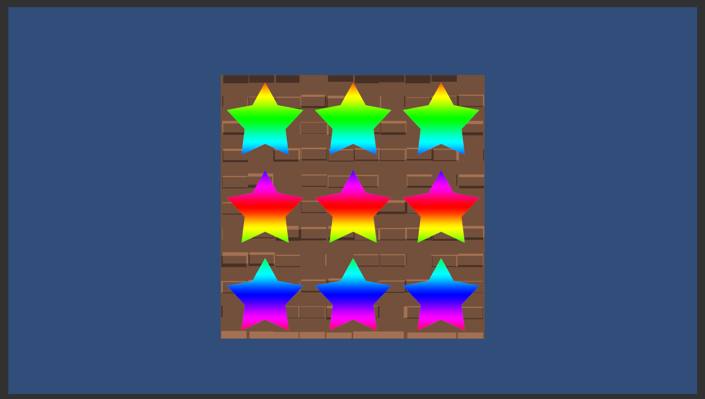
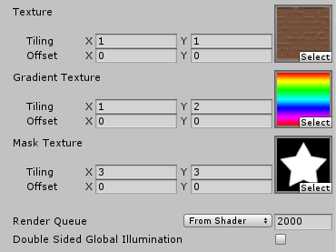

# MaskedUnlit

Unlit texture masking shader snippet which I created as a reminder for myself :).

The idea was to have a base texture, a mask texture and texture which is revealed/hidden based on the mask.
Naturally the mask could have been implemented as alpha channel in the base texture, but that's not how it is now. This is mainly for sake of simplicity and clarity instead of performance.

### features
- UI
- Tiling for each layer
- Offset for each layer

### shader in action

### shader UI

